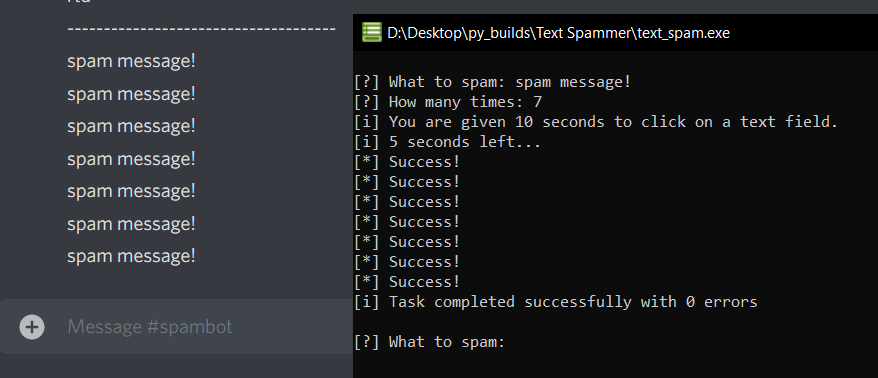

# TextSpammer
**Version:**
*0.1*
 
Spams text in selected text box
 
## Screenshots

  
**Note:** Please do not put letters in the second field: "How many times to spam", since it crashes the app.
 
\- Made with Python
